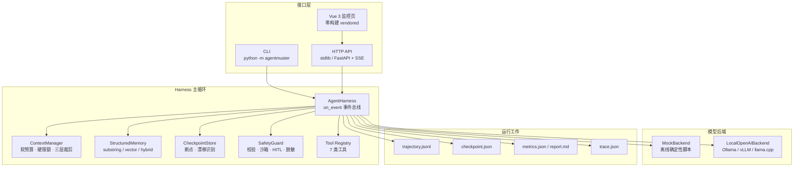

<div align="center">

# AgentMuster

**面向代码仓库长链路任务的本地 Agent 运行底座**

[](https://www.python.org)
[](LICENSE)
[](tests/)
[](requirements.txt)
[](#评测体系与实测结果)
[](CHANGELOG.md)

*上下文会膨胀、文件会反复读、中断就丢状态、跑完说不清发生了什么 —— AgentMuster 把这四件事当作工程问题来解决。*

</div>

---

## 它解决什么问题

| 长链路任务的典型故障 | AgentMuster 的做法 | 实现位置 |
| --- | --- | --- |
| 上下文膨胀，长任务中途爆窗 | 软预算触发折叠 + 硬限额强制截断，三层裁剪策略链式降级 | `agentmuster/context/` |
| 同一文件反复读，token 白烧 | 任务 / 文件 / 关联三层结构化记忆，follow-up 自动注入父任务摘要 | `agentmuster/memory/` |
| 中断即重来，进度全丢 | Checkpoint / Resume + 工作区 SHA256 指纹漂移识别 | `agentmuster/checkpoint/` |
| 工具乱跑、路径逃逸、密钥进日志 | Schema 校验 → 路径沙箱 → Shell 黑白名单 → 去重 → 重复/振荡 Guard → HITL 审批 → 脱敏，七道防线 + 动作白名单 | `agentmuster/safety/` |
| 跑完不知道发生了什么 | 轨迹 / 检查点 / 指标三类运行工件 + 链路追踪 + 可复现评测报告 | `agentmuster/artifacts.py`、`agentmuster/observability/` |
| 复杂目标单 Agent 一把梭容易失控 | Planner-Executor-Validator 多轮闭环：Completion Checklist 客观验收、缺失项精确回流重规划、失败即时重试并注入教训、全局预算熔断 | `agentmuster/agent/orchestrator.py`、`agentmuster/orchestrator/` |
| 分不清「系统不行」还是「模型不行」 | 裸模型基线对照：`single_shot` / `naive_loop` / `harness` 三臂同任务集对比 + Layer 7 多智能体基准与机制消融 | `agentmuster/eval/raw_baseline.py`、`agentmuster/eval/layer7_multiagent.py` |

**设计取向**：核心运行时只依赖 PyYAML；全部增强能力（Web API、向量检索、OTel 桥接、MCP 外部工具、真实模型接入）均为可选依赖组或零依赖实现，默认关闭或零依赖降级，保证任意新机器上 `pip install -e .` 之后测试与评测**全离线可跑**。

**演进说明**：本项目由两个同源项目合并演进而来——单 Agent 运行底座（原 MyCoder）吸收了多智能体角色闭环框架（原 miniMaster）的 Planner-Executor-Validator 编排层、行为安全防线与协议兼容工程，合并决策与接口对齐记录见 [`docs/MERGE_DESIGN.md`](docs/MERGE_DESIGN.md)。合并后的三层结构：

1. **单 Agent 底座**（`agentmuster/agent/`）：上下文治理 / 结构化记忆 / Checkpoint / 七道安全防线 / 工件系统；
2. **多智能体编排**（`agentmuster/orchestrator/` + `agent/agent/orchestrator.py`）：任务状态机 + 多轮闭环 + Retry Archive + 编排级断点续跑；
3. **七层评测**（`agentmuster/eval/`）：Layer 1-6b 离线与三臂对照 + Layer 7 多智能体端到端基准（客观检查器 + 机制消融）。

---

## 目录

- [快速开始](#快速开始)
- [架构总览](#架构总览)
- [核心能力](#核心能力)
- [命令行速查](#命令行速查)
- [配置速查](#配置速查)
- [评测体系与实测结果](#评测体系与实测结果)
- [项目结构](#项目结构)
- [文档地图](#文档地图)
- [贡献指南](#贡献指南)
- [许可证](#许可证)
- [常见问题](#常见问题)

---

## 快速开始

### 安装

```bash
# 方式一:pip(推荐,核心仅依赖 PyYAML)
python -m pip install -e .

# 方式二:Conda 一键重建完整环境(dev + api + vector 全量)
conda env create -p .conda -f environment.yml

# 方式三:Docker(内置 Ollama,首次启动自动拉取 qwen3.5:2b)
docker compose up -d
```

按需安装可选依赖组：

```bash
python -m pip install 'agentmuster-harness[api]'      # FastAPI + SSE 实时事件流 + 监控页
python -m pip install 'agentmuster-harness[vector]'   # 真实语义向量检索(fastembed / bge-small)
python -m pip install 'agentmuster-harness[otel]'     # OpenTelemetry 桥接
python -m pip install 'agentmuster-harness[dev]'     # ruff + mypy + pytest
```

### 跑通第一个任务

准备任务文件 `demo_task.json`（未指定模型后端时使用内置 Mock 脚本，全程离线确定性）：

```json
{
  "task_id": "demo_hello",
  "goal": "在项目中创建 hello.py,内含一个 greet 函数。",
  "files_hint": ["hello.py"],
  "script": [
    {"tool_calls": [{"name": "file_write", "arguments": {"path": "hello.py", "content": "def greet():\n    return 'hello'\n"}}]},
    {"content": "已创建 hello.py,任务完成。"}
  ]
}
```

执行：

```bash
python -m agentmuster run --task-file demo_task.json --workspace ./workspace
```

真实输出（节选）：

```json
{
  "task_id": "demo_hello",
  "status": "completed",
  "metrics": {
    "steps": 2,
    "tool_calls": 1,
    "write_calls": 1,
    "prompt_tokens_total": 299,
    "completion_tokens_total": 20,
    "cost_usd": 0.0,
    "files_remembered": 1,
    "denied_actions": 0
  },
  "final_answer": "已创建 hello.py,任务完成。",
  "artifacts_dir": ".agentmuster\\artifacts\\demo_hello"
}
```

一次运行即在 `.agentmuster/` 下沉淀完整工件，可直接复盘：

```
.agentmuster/
├── artifacts/demo_hello/   # trajectory.jsonl(逐步轨迹) + metrics.json + report.md
├── checkpoints/            # checkpoint.json(可 resume)
└── memory/                 # 任务 / 文件 / 关联三层记忆
```

### 接真实模型（可选）

默认后端是 MockBackend。改用本地 OpenAI 兼容服务（Ollama / vLLM / llama.cpp）只需显式指定配置：

```bash
# 前置:本地起好 Ollama,例如 ollama serve && ollama pull qwen3.5:2b
python -m agentmuster run --task-file demo_task.json --config config/default.yaml --backend local_openai

# 不确定环境是否就绪?先做体检
python -m agentmuster doctor
```

`doctor` 输出示例：

```
AgentMuster 环境诊断
========================================
Python: 3.11.16
  yaml       OK
  pytest     OK
模型后端: mock
工作区根: .
上下文预算: 4000 tokens
API 地址: 127.0.0.1:8910
```

### 启动 Web 监控页

```bash
python -m agentmuster serve --impl fastapi --config config/default.yaml --port 8910
```

浏览器打开 <http://127.0.0.1:8910/>，可在页面上选择执行后端（Mock / Ollama）、一键双跑对照，并通过 SSE 实时观察每一步工具调用。

### 跑测试与评测

```bash
python -m pytest tests/                                        # 272 项测试
python -m agentmuster eval --suite all --output .agentmuster/eval      # Layer 1-5 离线评测
python examples/real_model_demo.py                             # Layer 6 真实模型端到端(需 Ollama)
```

---

## 架构总览



一次任务的执行链路：**加载配置 → 组装上下文（任务目标 / 当前文件 / 历史摘要 / 工具结果）→ 调用模型 → 解析工具调用 → 过安全边界 → 执行工具 → 沉淀记忆 → 按需裁剪与落盘断点 → 直到终答**，全过程由 `on_event` 埋点驱动追踪与 Web 事件流。

---

## 核心能力

### 1. Agent Harness 主循环

统一封装模型调用、工具执行、会话状态、断点与运行日志，是全系统唯一的编排中枢。

- **空终答温和重问**：模型返回「无工具调用且无内容」时，自动注入提醒继续循环（`harness.empty_answer_nudges`，默认 1 次，`0` 关闭），把「交白卷」从静默完成变成可补救路径。
- **两类模型后端**：`MockBackend`（脚本化、确定性、测试与评测全离线）与 `LocalOpenAIBackend`（本地 OpenAI 兼容端点，带重试退避、流式、真实 token 计量）。
- **七类工具**：

| 工具 | 作用 | 属性 |
| --- | --- | --- |
| `file_read` / `file_write` / `file_edit` / `file_list` | 工作区内文件读写与列目录 | 读 / 写 |
| `grep_search` | 代码检索 | 读 |
| `shell_exec` | 受限 shell（白名单命令 + 黑名单模式） | 高风险，需审批 |
| `memory_query` | 查询结构化记忆 | 读 |

### 2. 长上下文治理

按「任务目标 / 当前文件 / 历史摘要 / 工具结果」分区组织上下文，超预算时按三级策略链式降级：

```
fold_old_turns  →  drop_stale_turns  →  truncate_long_content
(折叠旧轮次)       (丢弃过期轮次)        (截断超长内容)
```

摘要器可切换：`deterministic`（默认，可复现）或 `llm`（模型压缩，失败自动回退）。实测平均压缩率约 80%，预算内完成率 100%。

### 3. 结构化记忆与混合检索

三层分层存储：**任务摘要**（目标 / 状态 / 结论 / 关键决策 / 涉及文件）、**文件摘要**（哈希指纹 / 摘要 / 符号 / 最近访问）、**关联记忆**（任务↔文件、任务↔父任务、文件↔文件依赖）。follow-up 任务自动注入父任务摘要，避免重读。

| 检索模式 | 依赖 | 适用场景 |
| --- | --- | --- |
| `substring` | 零依赖（默认，向后兼容） | 精确符号名、文件名匹配 |
| `vector` | `HashingEmbedder`（字符 n-gram 哈希，零依赖） | 语义近似召回 |
| `hybrid` | 稠密向量 + 纯 Python BM25，`α` 加权融合 | 同义改写查询，召回最优 |

需要更强语义效果时，可将嵌入器升级为 `FastEmbedEmbedder`（bge-small，可选依赖 `[vector]`，首次运行需下载模型）。

### 4. Checkpoint / Resume

断点保存任务定义、上下文状态、工作区指纹与指标；中断后从断点无损恢复继续执行。恢复前以「文件路径 → SHA256」精确比对识别工作区漂移，避免基于过期状态续跑。

### 5. 工具与安全边界

请求从进入到执行需连过六道防线：

1. **参数校验**：JSON Schema 验证类型 / 必填 / 枚举 / 范围
2. **工作区隔离**：拦截 `../`、绝对路径、符号链接逃逸
3. **Shell 治理**：白名单命令 + 黑名单模式（`rm -rf`、`curl`、fork bomb 等）
4. **重复调用拦截**：读类工具缓存命中短路，写类工具标记跳过
5. **高风险审批（HITL）**：`prompt` / `allow` / `deny` 三档策略
6. **敏感信息脱敏**：API Key、密码、私钥等正则替换后才会写入工件

### 6. 可观测性

零依赖 `Span` / `Tracer` 导出 OTLP 风格 `trace.json`（含完整 span 层级与耗时）；安装 `opentelemetry-api` 时自动桥接真实 OTel Tracer，缺失则静默降级。埋点覆盖 `task_start` / `step_start` / `model_call` / `tool_call` / `step_end` / `checkpoint` / `task_end`。日志支持 `text` 与 `json` 两种格式，JSON 行可被 `json.loads` 直接解析。

### 7. Web API 与监控页

| 方法 | 路径 | 说明 |
| --- | --- | --- |
| `POST` | `/api/run` | 提交任务，立即返回 `task_id`，后台线程执行；可选 `backend` 字段按请求选择后端 |
| `POST` | `/api/compare` | 一键双跑对照：同目标提交 mock / local_openai 两臂，共享 `compare_group` |
| `GET` | `/api/run/{id}/events` | SSE 实时推送语义事件，以 `done` 哨兵结束 |
| `GET` | `/api/run/{id}` | 轮询任务状态 |
| `GET` | `/api/runs` | 任务列表（含 `backend` / `arm` / `compare_group` 元数据） |
| `GET` | `/health` | 健康检查 |

根路径返回本地 vendored 的 Vue 3 运行监控页（零构建、离线可用）。CLI 通过 `serve --impl stdlib | fastapi` 切换实现，默认 `stdlib` 保持零依赖。

### 8. 子代理编排（默认关闭）

`agent/orchestrator.py` 把复杂目标交给 Planner 分解为子任务，各子任务由**完全独立工作区 / 记忆 / 断点 / 工件根**的子 `AgentHarness` 经 `ThreadPoolExecutor` 并行执行；单个子任务失败标记 `failed` 不阻断整体（部分降级），汇总产出 `orchestration.json`。

---

## 命令行速查

| 命令 | 作用 | 常用参数 |
| --- | --- | --- |
| `run` | 运行一个任务 | `--task-file` `--backend` `--workspace` `--hitl-policy` `--config` |
| `resume` | 从断点恢复任务 | `--task-id` |
| `serve` | 启动 localhost HTTP API | `--impl stdlib\|fastapi` `--host` `--port` |
| `orchestrate` | 目标分解 + 子代理并行编排 | `--goal` `--max-workers` |
| `eval` | 运行评测 | `--suite all\|regression\|context\|memory\|resume\|retrieval\|real\|real_baseline\|embedder` `--output` |
| `benchmark` | 列出内置 benchmark 任务 | `--benchmarks` |
| `artifacts` | 查看某任务的运行工件 | `--task-id` |
| `doctor` | 环境诊断 | `--config` |

示例：

```bash
python -m agentmuster orchestrate --goal "实现用户认证模块,并补齐单元测试" --max-workers 4
python -m agentmuster artifacts --task-id demo_hello
```

---

## 配置速查

主配置文件 `config/default.yaml`（CLI 默认加载内置默认值，使用该文件时需显式 `--config config/default.yaml`）。

| 分组 | 关键项 | 说明 |
| --- | --- | --- |
| 工作区 | `workspace.root` / `allow_absolute` | 工具沙箱边界；默认禁止绝对路径 |
| 模型 | `model.backend` / `model.local_openai.*` / `model.pricing` | 后端选择、本地端点、成本价目表 |
| 主循环 | `harness.max_steps` / `max_tool_calls_per_turn` / `empty_answer_nudges` | 防死循环、空终答重问次数（默认 1，`0` 关闭） |
| 上下文 | `context.budget_tokens` / `hard_limit_tokens` / `keep_last_turns` / `summarizer` | 软预算 4000、硬上限 6000、保留最近 6 轮、摘要器类型 |
| 记忆 | `memory.enabled` / `retrieval.mode` / `retrieval.alpha` / `retrieval.embedder` | 检索模式与混合权重、嵌入器选择 |
| 断点 | `checkpoint.enabled` / `interval_steps` / `detect_drift` | 每 4 步落盘、裁剪前强制落盘、恢复时识别漂移 |
| 安全 | `safety.hitl_policy` / `dedup_enabled` / `shell.allow_commands` / `deny_patterns` | 审批策略与命令黑白名单 |
| 工件 | `artifacts.root` / `redact_artifacts` / `sft_log` | 工件根目录、脱敏、SFT 样本采集开关 |
| 服务 | `api.host` / `api.port` / `logging.format` / `observability.enabled` | 默认 `127.0.0.1:8910` |

---

## 评测体系与实测结果

评测的核心方法是**对照实验**：固定任务、固定数据、只改变系统开关，从而区分「系统能力」与「模型能力」。

| Layer | 评测对象 | 数据规模 |
| --- | --- | --- |
| 1 | Harness 回归：能完成、工件齐全、断言满足 | 手写 17 个 |
| 2 | 上下文治理：治理 vs 不治理的 prompt 长度差 | 手写 4 个 |
| 3 | 记忆收益：follow-up 重复读文件次数、正确率 | 手写 4 个 |
| 4 | 恢复正确性：checkpoint / resume + 漂移识别 | 手写 1 个 |
| 5 | 检索召回：`exact` / `synonym` / `distractor` / `empty` 四类查询 | 82 条查询 |
| — | 固定 seed 冻结基准（保证跨提交可复现） | 42 个任务 |
| 6 | 真实模型端到端 + LLM-as-judge（需 Ollama） | 4 个编码任务 |
| 6b | 裸模型基线对照：`single_shot` / `naive_loop` / `harness` 三臂 | 复用 Layer 6 任务集 |

### 关键结果

| 指标 | 结果 |
| --- | --- |
| 上下文平均压缩率 | ~80%（最高 ~81%），预算内完成率 100% |
| follow-up 重复读文件 | 2 次 → 0 次，任务正确率 100% |
| 工作区漂移识别 | 10 个恢复场景，准确率 100% |
| 检索 recall@1 / @3 / @5（n=82） | `substring` 28% / 28% / 28% → `hybrid` 61% / 63% / 63% |
| 检索 MRR@5（n=82） | `substring` 0.44 → `hybrid` 0.98 |
| 三臂对照（qwen3.5:2b，硬断言口径） | `single_shot` 1/4、`naive_loop` 3/4、`harness` 4/4 |
| 安全边界 | 参数校验与路径逃逸拦截至 100%（回归样本） |

三臂对照说明：工具循环是成功率的主要跃升来源（1/4 → 3/4），完整的上下文治理、记忆与容错机制再补齐剩余任务（3/4 → 4/4）。代价是 prompt token 上升：`single_shot` 529 / `naive_loop` 14,564 / `harness` 115,919。

### 结果边界（如实标注）

- Layer 1–5 与全部 272 项 pytest 使用 `MockBackend` 离线回放，度量的是**系统能力**，不代表模型能力。
- Layer 6 的 LLM-as-judge 由 2b 小模型担任，实测 0/4 通过、判定不可靠；该结果如实保留在 `real_report.json`，**不以硬断言通过冒称评委通过**。
- 2b 模型跨运行方差大（同一任务曾出现空终答失败），单次运行胜负仅供参考；换用更大模型或放宽评委超时可获得更稳定结论。

---

## 项目结构

<details>
<summary>展开完整目录树</summary>

```
agentmuster/
├── agentmuster/                     # 核心代码包
│   ├── cli.py                   # 命令行入口(run/resume/serve/eval/benchmark/artifacts/doctor/orchestrate)
│   ├── config.py                # 配置加载与合并
│   ├── state.py                 # 会话状态模型
│   ├── artifacts.py             # 三类运行工件(轨迹/检查点/指标报告)
│   ├── tasks.py                 # 任务文件加载
│   ├── cost.py                  # 按价目表核算成本
│   ├── sft_collector.py         # SFT 微调样本采集
│   ├── models/                  # 模型后端:MockBackend / LocalOpenAIBackend
│   ├── tools/                   # 7 类工具 + Workspace 沙箱
│   ├── context/                 # 上下文治理:token 估算 / 摘要器 / ContextManager
│   ├── memory/                  # 结构化记忆 + 向量检索(Hashing / BM25 / Hybrid)
│   ├── checkpoint/              # 断点存储 + 工作区漂移识别
│   ├── safety/                  # 安全边界:SafetyGuard / 脱敏
│   ├── agent/                   # AgentHarness 主循环 + Orchestrator 子代理编排
│   ├── observability/           # 零依赖 Span / Tracer(OTLP 风格导出)
│   ├── api/                     # stdlib / FastAPI+SSE 服务 + Vue 3 监控页
│   └── eval/                    # 评测运行器、LLM-as-judge、真实模型与裸基线评测
├── benchmarks/                  # 评测数据:26 手写 + 42 冻结任务 + 82 检索查询 + 4 真实任务
├── tests/                       # pytest 测试套件(19 个文件,272 项)
├── examples/                    # 示例脚本(综合演示 / 上下文演示 / 真实模型演示)
├── config/                      # default.yaml(本地) 与 docker.yaml(容器)
├── docs/                        # 文档(架构 / 测试 / 学习指南 / 改进计划等)
├── kb_lora/                     # 企业知识库 LoRA 微调线
├── Dockerfile / docker-compose.yml
├── environment.yml              # Conda 环境定义
└── requirements*.txt            # 核心与可选依赖清单
```

</details>

---

## 文档地图

| 文档 | 内容 |
| --- | --- |
| [docs/LEARNING_GUIDE.md](docs/LEARNING_GUIDE.md) | 学习指南，**初学者的推荐起点** |
| [docs/ARCHITECTURE.md](docs/ARCHITECTURE.md) | 架构设计与分层职责 |
| [docs/TESTING.md](docs/TESTING.md) | 测试方法、质量门（本地 ruff / mypy / pytest） |
| [docs/OUTLINE.md](docs/OUTLINE.md) | 项目大纲与模块清单 |
| [docs/EVAL_HARDENING.md](docs/EVAL_HARDENING.md) | 评测加固方案 |
| [docs/IMPROVEMENT_PLAN.md](docs/IMPROVEMENT_PLAN.md) | 企业化改造分期计划与结果记录 |
| [docs/WEB_BACKEND_SWITCH.md](docs/WEB_BACKEND_SWITCH.md) | Web 后端切换与一键双跑对照设计 |
| [docs/FINAL_SUMMARY.md](docs/FINAL_SUMMARY.md) | 交付总结 |
| [CHANGELOG.md](CHANGELOG.md) | 变更日志（与 conventional commits 对应） |

---

## 贡献指南

欢迎 Issue 与 PR。为保证改动能顺利合并，请遵循以下约定。

**1. 准备开发环境**

```bash
python -m pip install -e ".[dev]"    # 或 conda env create -p .conda -f environment.yml
python -m pytest tests/               # 确认基线 272 项全绿
```

**2. 代码规范**

```bash
python -m ruff check .                # 行宽 110,规则集见 pyproject.toml
python -m mypy                        # 覆盖 agentmuster 与 tests
```

**3. 提交前自检清单**

- 新增功能必须附带测试；涉及模型调用的部分请使用 `MockBackend` 或 monkeypatch，保证**离线可测**。
- 新能力默认关闭或零依赖实现，不得破坏既有测试的确定性与离线 CI。
- 涉及评测口径改动时，同步更新 `benchmarks/` 数据说明与本 README 的结果表格。

**4. 提交与 PR**

- 提交信息遵循 [Conventional Commits](https://www.conventionalcommits.org/)：`feat(memory): ...`、`fix(safety): ...`、`docs: ...`、`test: ...`。
- PR 请说明：动机、改动范围、验证方式（`pytest` / `eval` 命令与结果）。
- 破坏性变更需在 `CHANGELOG.md` 的 `Unreleased` 小节记录。

**5. 三条设计原则**（评审时会重点看）

1. **核心零依赖**：新增能力若引入第三方依赖，必须下沉到可选依赖组。
2. **确定性优先**：可复现优先于"聪明"，默认路径必须能离线稳定重跑。
3. **如实度量**：指标不凑满分，样本量与局限必须同时呈现。

---

## 许可证

本项目基于 [MIT License](LICENSE) 发布。

```
MIT License

Copyright (c) 2026 shangguanyunji663
```

---

## 常见问题

<details>
<summary><b>必须联网吗？</b></summary>

不需要。核心运行时只依赖 PyYAML，Layer 1–5 评测与全部 272 项测试均使用 MockBackend 离线跑通。只有 Layer 6 / 6b 真实模型评测、以及切换到 `FastEmbedEmbedder` 时才需要本地或网络模型服务。

</details>

<details>
<summary><b>支持哪些模型？</b></summary>

任何 OpenAI 兼容端点均可：Ollama（`127.0.0.1:11434/v1`）、vLLM、llama.cpp 等。修改 `model.backend: local_openai` 与 `model.local_openai.*`，或用 `--backend local_openai` 临时覆盖即可。

</details>

<details>
<summary><b>会误改我仓库里的文件吗？</b></summary>

工具受 `workspace.root` 沙箱约束（默认当前目录，可用 `--workspace` 覆盖），路径逃逸、绝对路径与符号链接会被拦截；`shell_exec` 走白名单并默认需要人工审批（`safety.hitl_policy: prompt`）。运行工件统一写入 `.agentmuster/`，建议将其加入 `.gitignore`。

</details>

<details>
<summary><b>为什么 README 里的指标大多来自 MockBackend？</b></summary>

因为这样度量的才是**系统能力**：同一份脚本化输入下，只有系统开关注入差异（有无治理、有无记忆、有无断点）。模型能力单独由 Layer 6 / 6b 在固定模型与任务集上对照评估，两者口径分离、互不冒充。

</details>
